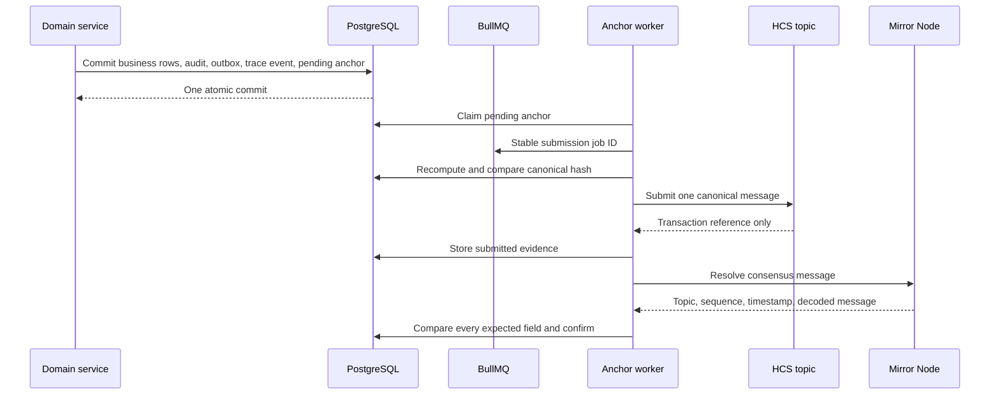

# Hedera Consensus Service anchoring

## Purpose and authority

Phase 4 adds independently timestamped integrity evidence for selected traceability events. PostgreSQL
remains authoritative for business state, authorization, corrections, and public claims. Hedera
Consensus Service (HCS) stores a deterministic payload hash and minimal privacy-safe metadata. It is
not a business database, payment rail, identity registry, or source of physical truth.

## Transaction and worker flow

The database transaction atomically creates the business mutation, outbox event, canonical
`TraceabilityEvent`, and one `HederaAnchor`. Redis and Hedera are never called inside that transaction.
The durable dispatcher claims database work and enqueues a stable job ID. Workers conditionally claim
states, so duplicate queue delivery does not create a second logical anchor.

## Canonicalization and privacy references

Canonical JSON sorts object keys, preserves array order, normalizes strings to Unicode NFC, serializes
dates as UTC ISO-8601 strings, serializes decimals and integers deterministically, preserves explicit
`null`, and rejects `undefined` and non-finite numbers. Hashes use SHA-256 and the lowercase
`sha256:<hex>` representation. Any canonicalization change requires a new schema version; old hashes
must remain reproducible.

Messages contain an event ID, event type, schema version, keyed organization/entity references,
payload hash, predecessor hash, occurrence time, and optional supersession reference. References use
HMAC-SHA-256 with a dedicated server-side secret and version. They are not plain database UUIDs. No
names, phone numbers, farmer IDs, farm coordinates, quality notes, weights, prices, credentials, or
complete business records may be sent to HCS.

## Confirmation and reconciliation

A successful SDK submission is `SUBMITTED`, not `CONFIRMED`. Confirmation requires a Mirror Node
message whose network, topic, transaction, event ID, type, references, payload hash, predecessor hash,
and schema all match the expected canonical message. Verification evidence is append-only.

Timeouts after submission are unknown outcomes. They remain discoverable by transaction ID and topic
scan and are never blindly resubmitted. Reconciliation reads bounded pages from the last durable topic
checkpoint under an advisory lock. Known matching messages advance anchors; unknown messages are
reported without creating business records; mismatches become operator-visible integrity failures.

## Corrections and hash chains

Each organization/entity stream has an ordered predecessor-hash chain allocated under a PostgreSQL
transaction lock. Corrections create new facts and anchors. Once the replacement is confirmed, the old
anchor becomes `SUPERSEDED`; it is never deleted or rewritten. A missing or incorrect predecessor is
reported as `CHAIN_BROKEN`.

## Provider boundary

`packages/hedera` is framework-independent. Local and CI use a realistic in-memory mock ledger and
Mirror provider. The SDK provider supports testnet, previewnet, and explicitly acknowledged mainnet
configuration, but Phase 4 rollout is mock/local by default. It uses one attempt per SDK call, one HCS
chunk, a message-size bound, and a configured fee ceiling. Retry policy belongs to the durable worker,
not the SDK.

Phase 4 does not include HTS, stablecoins, smart contracts, Guardian, carbon workflows, marketplace,
payments, settlement, mobile money, or mainnet rollout.
